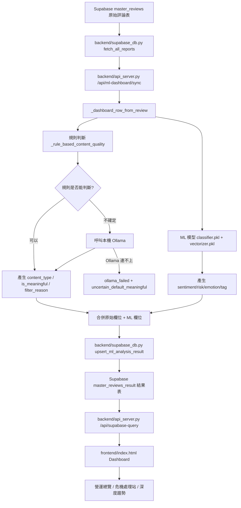
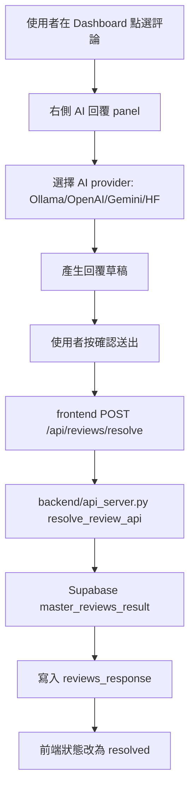
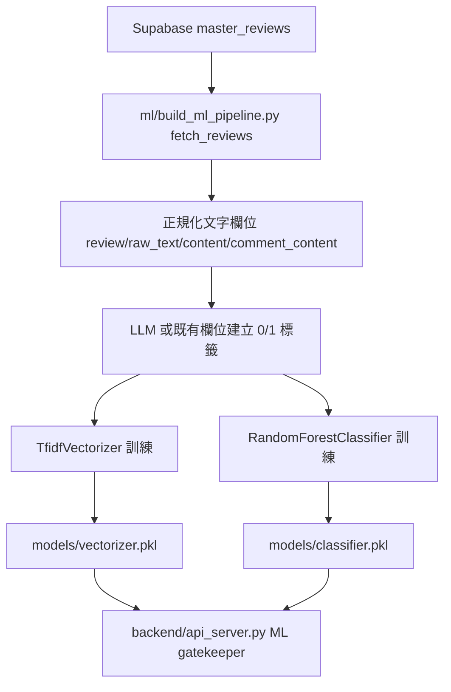
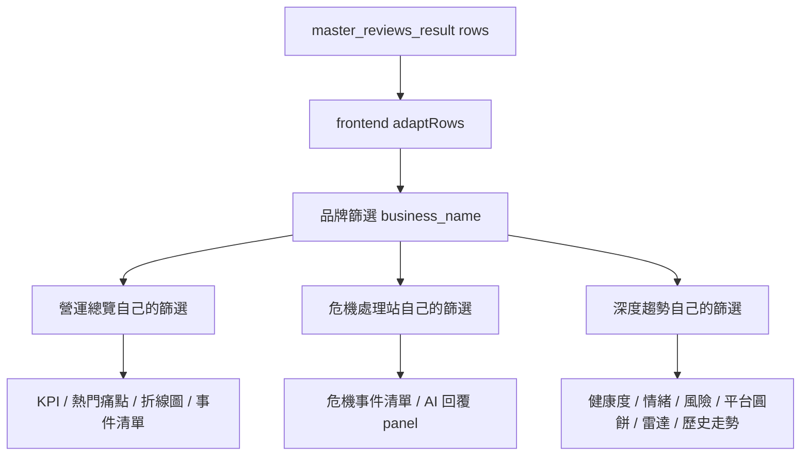

# Group Project Final 專案完整說明文件

本文說明 `D:\DATA\group-project-final` 專案的資料夾架構、各檔案用途、彼此影響關係、會產出的檔案/資料，以及從 Supabase 讀取資料、ML 分析、寫入結果表、Dashboard 呈現、AI 回覆寫回資料庫的完整資料流程。

**LINK：https://group-project-v1-jvjspvsb9d3qsbcqrebylh.streamlit.app/**

> 注意：本文件不列出 `.env` 內的真實 Supabase Key 或其他密鑰。`.env` 屬於本機私密設定，請勿上傳到 GitHub 或貼給他人。

---

## 目錄

- [1. 專案定位](#1-專案定位)
- [2. 專案資料夾架構](#2-專案資料夾架構)
- [3. 根目錄檔案說明](#3-根目錄檔案說明)
  - [`.env`](#env)
  - [`.env.example`](#envexample)
  - [`requirements.txt`](#requirementstxt)
  - [`README.md`](#readmemd)
  - [`.gitignore`](#gitignore)
  - [`.python-version`](#python-version)
- [4. `backend/` 後端資料夾](#4-backend-後端資料夾)
  - [`backend/api_server.py`](#backendapi_serverpy)
  - [`backend/supabase_db.py`](#backendsupabase_dbpy)
  - [`backend/__pycache__/`](#backend__pycache__)
- [5. `frontend/` 前端資料夾](#5-frontend-前端資料夾)
  - [`frontend/index.html`](#frontendindexhtml)
- [6. `ml/` ML 訓練資料夾](#6-ml-ml-訓練資料夾)
  - [`ml/build_ml_pipeline.py`](#mlbuild_ml_pipelinepy)
  - [`ml/__pycache__/`](#ml__pycache__)
- [7. `models/` 模型資料夾](#7-models-模型資料夾)
  - [`models/vectorizer.pkl`](#modelsvectorizerpkl)
  - [`models/classifier.pkl`](#modelsclassifierpkl)
- [8. `prompts/` Prompt 資料夾](#8-prompts-prompt-資料夾)
  - [`prompts/ml_prompts.py`](#promptsml_promptspy)
  - [`prompts/sentiment_analyzer.txt`](#promptssentiment_analyzertxt)
  - [`prompts/pr_generator_openai_positive.txt`](#promptspr_generator_openai_positivetxt)
  - [`prompts/pr_generator_openai_negative.txt`](#promptspr_generator_openai_negativetxt)
  - [`prompts/pr_generator_ollama_positive.txt`](#promptspr_generator_ollama_positivetxt)
  - [`prompts/pr_generator_ollama_negative.txt`](#promptspr_generator_ollama_negativetxt)
  - [`prompts/pr_reviewer.txt`](#promptspr_reviewertxt)
  - [`prompts/dashboard_reply_ollama_positive.txt`](#promptsdashboard_reply_ollama_positivetxt)
  - [`prompts/dashboard_reply_ollama_negative.txt`](#promptsdashboard_reply_ollama_negativetxt)
- [9. `data/` 資料資料夾](#9-data-資料資料夾)
  - [`data/menu.txt`](#datamenutxt)
  - [`data/laws.txt`](#datalawstxt)
  - [`data/ml_dashboard_export.csv`](#dataml_dashboard_exportcsv)
- [10. `streamlit/` Streamlit 支線](#10-streamlit-streamlit-支線)
  - [`streamlit/streamlit_dashboard.py`](#streamlitstreamlit_dashboardpy)
  - [`streamlit/STREAMLIT_DEPLOYMENT.md`](#streamlitstreamlit_deploymentmd)
  - [`streamlit/.streamlit/config.toml`](#streamlitstreamlitconfigtoml)
  - [`streamlit/.streamlit/secrets.toml.example`](#streamlitstreamlitsecretstomlexample)
- [11. `tools/` 工具資料夾](#11-tools-工具資料夾)
  - [`tools/probe_schema.py`](#toolsprobe_schemapy)
  - [`tools/test_supabase_write.py`](#toolstest_supabase_writepy)
- [12. `archive/` 封存資料夾](#12-archive-封存資料夾)
  - [`archive/prototypes/`](#archiveprototypes)
  - [`archive/vercel/api/`](#archivevercelapi)
- [13. Supabase 資料表設計](#13-supabase-資料表設計)
  - [來源表：`master_reviews`](#來源表master_reviews)
  - [結果表：`master_reviews_result`](#結果表master_reviews_result)
- [14. 內容類型分類說明](#14-內容類型分類說明)
- [15. 完整資料流程圖](#15-完整資料流程圖)
  - [15.1 主資料流：從 Supabase 到 Dashboard](#151-主資料流從-supabase-到-dashboard)
  - [15.2 Dashboard AI 回覆寫回流程](#152-dashboard-ai-回覆寫回流程)
  - [15.3 ML 訓練流程](#153-ml-訓練流程)
  - [15.4 前端篩選與圖表流程](#154-前端篩選與圖表流程)
- [16. 常用操作指令](#16-常用操作指令)
  - [安裝套件](#安裝套件)
  - [啟動後端](#啟動後端)
  - [檢查後端健康狀態](#檢查後端健康狀態)
  - [執行 ML 訓練](#執行-ml-訓練)
  - [同步 ML 分析到 Supabase 結果表](#同步-ml-分析到-supabase-結果表)
  - [檢查 Dashboard result rows](#檢查-dashboard-result-rows)
  - [啟動 Ollama](#啟動-ollama)
- [17. 檔案影響關係總表](#17-檔案影響關係總表)
- [18. 目前主線與非主線判斷](#18-目前主線與非主線判斷)
  - [主線](#主線)
  - [支線](#支線)
  - [封存](#封存)
- [19. 維護注意事項](#19-維護注意事項)
- [20. 建議後續改善](#20-建議後續改善)

---

## 1. 專案定位

本專案目前主線是：

1. 從 Supabase 的 `master_reviews` 讀取原始評論資料。
2. 使用本機 ML 模型與規則判斷產生情緒、風險、主題、內容品質等分析欄位。
3. 將分析結果寫入 Supabase 的 `master_reviews_result`。
4. 使用 FastAPI 提供 API。
5. 使用 `frontend/index.html` 作為後台 Dashboard。
6. Dashboard 讀取 `master_reviews_result`，提供品牌、平台、內容類型、風險、深度趨勢等篩選與圖表。
7. Dashboard 可產生 AI 回覆，送出後寫回 `master_reviews_result.reviews_response`。

目前不再使用 Vercel 主線。Vercel 相關檔案已放在 `archive/vercel/` 作為封存參考。

---

## 2. 專案資料夾架構

```text
D:\DATA\group-project-final
├─ .env                                      # 本機私密環境變數：Supabase URL/Key、Ollama、OpenAI、表名設定
├─ .env.example                              # .env 範本，給新環境複製使用，不含真實 key
├─ .gitignore                                # Git 忽略規則，避免上傳 .env、快取、暫存檔
├─ .python-version                           # Python 版本參考設定
├─ README.md                                 # 本專案完整說明文件，目前包含架構、流程、API、維護說明
├─ requirements.txt                          # Python 套件需求清單，後端/ML/Streamlit 都會用到
├─ archive                                   # 封存資料，不是目前主線，只作為舊版或參考用
│  ├─ prototypes                             # 早期 prototype 程式與舊 dashboard
│  │  ├─ app.py                              # 早期應用雛形
│  │  ├─ dashboard.html                      # 舊版 dashboard HTML 原型
│  │  ├─ supabase_rag_prototype.py           # 舊版 Supabase + RAG 測試程式
│  │  └─ web_app.py                          # 舊版 web app prototype
│  └─ vercel                                 # 舊 Vercel 部署版本，目前已不使用
│     └─ api
│        ├─ ai-reply.py                      # 舊 Vercel AI 回覆 API
│        ├─ health.py                        # 舊 Vercel health check API
│        └─ supabase-query.py                # 舊 Vercel Supabase query API
├─ backend                                   # FastAPI 後端主線，負責 API、Supabase 讀寫、ML sync、AI 回覆寫回
│  ├─ api_server.py                          # 主後端入口：Dashboard API、ML 分析、AI 回覆、HTML serve
│  ├─ supabase_db.py                         # Supabase 資料層：讀 master_reviews、寫/讀 master_reviews_result
│  └─ __pycache__                            # Python 自動產生快取，可刪除
├─ data                                      # RAG 知識資料與 Dashboard 匯出資料
│  ├─ laws.txt                               # 法務/消保/食安相關文字資料，供 AI 回覆參考
│  ├─ menu.txt                               # 品牌/菜單/餐點知識資料，供 AI 回覆參考
│  └─ ml_dashboard_export.csv                # 後端分析流程匯出的 CSV 檔，便於人工檢查
├─ frontend                                  # 前端 Dashboard
│  └─ index.html                             # 單檔 Dashboard：UI、RWD、篩選、圖表、AI 回覆操作都在此
├─ ml                                        # ML 訓練管線
│  ├─ build_ml_pipeline.py                   # 從 Supabase 取資料、建立標籤、訓練模型、輸出 pkl
│  └─ __pycache__                            # Python 自動產生快取，可刪除
├─ models                                    # ML 模型輸出資料夾，後端啟動時會載入
│  ├─ classifier.pkl                         # 危機/風險分類模型
│  └─ vectorizer.pkl                         # 文字向量化器，將評論轉為模型特徵
├─ prompts                                   # AI prompt 集中管理，影響分類、回覆生成與審查語氣
│  ├─ dashboard_reply_ollama_negative.txt    # Dashboard 負面評論 Ollama 回覆 prompt
│  ├─ dashboard_reply_ollama_positive.txt    # Dashboard 正面評論 Ollama 回覆 prompt
│  ├─ ml_prompts.py                          # ML pipeline 自動標籤用 prompt
│  ├─ pr_generator_ollama_negative.txt       # Ollama 負面公關回覆生成 prompt
│  ├─ pr_generator_ollama_positive.txt       # Ollama 正面公關回覆生成 prompt
│  ├─ pr_generator_openai_negative.txt       # OpenAI 負面公關回覆生成 prompt
│  ├─ pr_generator_openai_positive.txt       # OpenAI 正面公關回覆生成 prompt
│  ├─ pr_reviewer.txt                        # AI 回覆審查 prompt
│  └─ sentiment_analyzer.txt                 # 情緒分析 prompt
├─ streamlit                                 # Streamlit 支線，不是目前主要 Dashboard
│  ├─ .streamlit                             # Streamlit 設定資料夾
│  │  ├─ config.toml                         # Streamlit UI/Server 設定
│  │  └─ secrets.toml.example                # Streamlit secrets 範本，不含真實 key
│  ├─ STREAMLIT_DEPLOYMENT.md                # Streamlit 部署說明
│  ├─ streamlit_dashboard.py                 # Streamlit 版本 dashboard，支線使用
│  └─ __pycache__                            # Python 自動產生快取，可刪除
└─ tools                                     # 輔助測試工具，非主線功能
   ├─ probe_schema.py                        # 探查 Supabase table 欄位用
   └─ test_supabase_write.py                 # 測試 Supabase 寫入用，使用前需小心避免寫入測試資料
```

---

## 3. 根目錄檔案說明

### `.env`

用途：

- 儲存本機執行需要的環境變數。
- 後端、ML pipeline、Supabase client 都會讀取。

主要變數：

```env
SUPABASE_URL
SUPABASE_ANON_KEY
SUPABASE_SERVICE_ROLE_KEY
SUPABASE_KEY
SUPABASE_TABLE_NAME=master_reviews
SUPABASE_RESULT_TABLE_NAME=master_reviews_result
ENGINE=ollama
OLLAMA_BASE_URL=http://localhost:11434
OLLAMA_MODEL=qwen2.5:3b
OPENAI_API_KEY
MAX_RECORDS
BATCH_SIZE
SLEEP_SECONDS
ML_GATEKEEPER_THRESHOLD
```

影響檔案：

- `backend/supabase_db.py`
- `backend/api_server.py`
- `ml/build_ml_pipeline.py`
- `streamlit/streamlit_dashboard.py`

會產出：

- 不直接產出檔案。
- 但它決定資料來源、寫入目標、Ollama/OpenAI 使用方式。

注意：

- `SUPABASE_SERVICE_ROLE_KEY` 是 secret，僅後端使用。
- 不要把 `.env` 提交到 GitHub。
- 前端 `frontend/index.html` 不應放任何 secret key。

---

### `.env.example`

用途：

- 提供 `.env` 範本。
- 讓新環境知道需要哪些 Key 與設定。

影響檔案：

- 不被程式直接使用。
- 供人工複製為 `.env`。

會產出：

- 不直接產出資料。

---

### `requirements.txt`

用途：

- Python 套件需求清單。

目前包含：

```text
streamlit
pandas
langgraph
langchain-openai
langchain-community
langchain-text-splitters
langchain-ollama
chromadb
python-dotenv
fastapi
uvicorn
supabase
scikit-learn
joblib
```

影響檔案：

- `backend/api_server.py`
- `backend/supabase_db.py`
- `ml/build_ml_pipeline.py`
- `streamlit/streamlit_dashboard.py`

安裝方式：

```powershell
cd D:\DATA\group-project-final
python -m pip install -r requirements.txt
```

會產出：

- 安裝到目前 Python 環境的 site-packages。

---

### `README.md`

用途：

- 簡短版專案說明。
- 提供本機啟動、ML sync、Streamlit 支線與封存說明。

與本文件關係：

- `README.md` 是快速上手。
- `PROJECT_FULL_DOCUMENTATION.md` 是完整維護文件。

---

### `.gitignore`

用途：

- 告訴 Git 哪些檔案不要提交。
- 通常應忽略 `.env`、`__pycache__`、模型暫存、輸出檔等。

---

### `.python-version`

用途：

- 指定 Python 版本參考。
- 若使用 pyenv 或相似工具，可讀取此檔案。

---

## 4. `backend/` 後端資料夾

`backend/` 是目前專案的主後端。FastAPI server、Supabase 讀寫、ML 分析 API、AI 回覆 API 都在這裡。

---

### `backend/api_server.py`

用途：

- FastAPI 主伺服器。
- 提供 Dashboard HTML。
- 提供 Dashboard API。
- 執行 ML dashboard 分析。
- 執行 AI 回覆生成。
- 將 AI 回覆寫回 Supabase。
- 載入 `models/classifier.pkl` 與 `models/vectorizer.pkl` 進行 ML gatekeeper。
- 讀取 `prompts/`、`data/menu.txt`、`data/laws.txt` 作為 RAG/Prompt 參考資料。

主要功能區塊：

| 區塊 | 作用 |
|---|---|
| `_load_prompt_file()` | 從 `prompts/` 讀取 prompt |
| `_load_ml_gatekeeper()` | 載入 `models/classifier.pkl`、`models/vectorizer.pkl` |
| `_ml_predict_crisis_prob()` | 用 ML 模型預測危機機率 |
| `_heuristic_crisis_prob()` | 模型不可用時的規則風險估算 |
| `_risk_level()` | 將風險分數轉為 `low / medium / high / critical` |
| `_topic_tag()` | 依文字判斷 `food / service / environment / price / other` |
| `_rule_based_content_quality()` | 用規則判斷留言是否有意義 |
| `_classify_content_quality_with_ollama()` | 規則不確定時呼叫本機 Ollama 判斷 |
| `_dashboard_row_from_review()` | 將 Supabase 原始資料轉成 Dashboard/ML 結果列 |
| `_export_dashboard_csv()` | 輸出 `data/ml_dashboard_export.csv` |
| LangGraph workflow | 分析情緒、RAG 檢索、生成 PR 回覆、審查 |

主要 API：

| Method | Path | 用途 | 讀/寫 |
|---|---|---|---|
| GET | `/` | 回傳 `frontend/index.html` | 讀檔 |
| GET | `/dashboard` | 回傳 `frontend/index.html` | 讀檔 |
| GET | `/api/health` | 健康檢查 | 無 |
| GET | `/api/ml-dashboard` | 從 `master_reviews` 產生 Dashboard rows | 讀 source + 輸出 CSV |
| GET | `/api/ml-dashboard-results` | 從 `master_reviews_result` 讀 Dashboard rows | 讀 result |
| GET | `/api/supabase-query` | 前端相容 API，預設讀 `master_reviews_result` | 讀 result |
| POST | `/api/ml-dashboard/sync` | 從 `master_reviews` 分析後 upsert 到 `master_reviews_result` | 讀 source + 寫 result |
| POST | `/api/ml-dashboard/analyze` | 對傳入 rows 做 Dashboard 分析 | 不一定寫 DB |
| POST | `/api/dashboard-reply` | 產生 Dashboard 回覆草稿 | 不寫 DB |
| POST | `/api/reviews/resolve` | 將回覆寫入 `master_reviews_result.reviews_response` | 寫 result |
| POST | `/api/ai-reply` | 前端 AI proxy，支援 OpenAI/Gemini/HF | 外部 API |
| POST | `/api/analyze` | 單筆評論完整 LangGraph PR 分析流程 | 可寫 source |

目前重要資料表行為：

- 讀取原始表：`SUPABASE_TABLE_NAME`，預設 `master_reviews`
- 寫入分析結果表：`SUPABASE_RESULT_TABLE_NAME`，預設 `master_reviews_result`
- Dashboard 前端主要讀：`master_reviews_result`
- AI 回覆提交寫入：`master_reviews_result.reviews_response`

會產出：

| 產出 | 說明 |
|---|---|
| HTTP API | 提供前端呼叫 |
| `data/ml_dashboard_export.csv` | Dashboard 分析輸出 CSV |
| Supabase `master_reviews_result` rows | `/api/ml-dashboard/sync` 寫入 |
| Supabase `master_reviews_result.reviews_response` | AI 回覆提交後寫入 |
| Console log | 後端執行與錯誤訊息 |

會影響的相關檔案：

- 改 API path 或資料欄位會影響 `frontend/index.html`
- 改 Supabase table/欄位會影響 `backend/supabase_db.py`
- 改 ML 模型載入會影響 `models/`
- 改 prompt 名稱或位置會影響 `prompts/`
- 改 CSV 匯出欄位會影響 `data/ml_dashboard_export.csv`

啟動方式：

```powershell
cd D:\DATA\group-project-final
python backend\api_server.py
```

若 8000 已被舊服務占用，可用目前開發常用的 8001 啟動：

```powershell
python -c "import sys; sys.path.insert(0, r'D:\DATA\group-project-final\backend'); import uvicorn, api_server; uvicorn.run(api_server.app, host='127.0.0.1', port=8001)"
```

---

### `backend/supabase_db.py`

用途：

- 集中管理 Supabase client。
- 從 `.env` 讀取 Supabase 設定。
- 讀取 `master_reviews`。
- 讀取 `master_reviews_result`。
- 將 ML 分析結果 upsert 到 `master_reviews_result`。
- 提供歷史相似評論查詢。

主要函式：

| 函式 | 用途 |
|---|---|
| `_env_value()` | 讀環境變數，過濾 placeholder |
| `init_dynamic_client()` | 動態初始化 Supabase client |
| `save_pr_report()` | 舊流程使用，將單筆 PR 分析結果寫入 source table |
| `search_similar_reviews()` | 依 embedding 搜尋相似評論 |
| `fetch_all_reports()` | 從 `master_reviews` 分頁讀取所有來源資料 |
| `get_table_columns()` | 讀取 source table 欄位 |
| `fetch_existing_result_ids()` | 從 `master_reviews_result` 讀已分析 ID，用於 incremental sync |
| `fetch_result_reports()` | 從 `master_reviews_result` 分頁讀取 Dashboard 資料 |
| `upsert_ml_analysis_result()` | 將分析結果 upsert 到 `master_reviews_result` |
| `update_ml_analysis_fields()` | 舊相容名稱，實際呼叫 `upsert_ml_analysis_result()` |

重要欄位對應：

`upsert_ml_analysis_result()` 會把 source 欄位與 ML 欄位合併寫到 result table：

原始欄位：

```text
master_review_id
business_id
business_name
platform
posts_id
post_published_at
post_title
post_author_id
post_author_name
comment_author_id
comment_author_name
comment_content
comment_published_at
```

ML 欄位：

```text
sentiment_label
sentiment_score
risk_score
risk_level
emotion_joy
emotion_anger
emotion_disappointment
reviews_tag
analyzed_at
is_meaningful
content_type
content_quality_score
filter_reason
```

AI 回覆欄位：

```text
reviews_response
```

會產出：

| 產出 | 說明 |
|---|---|
| Supabase client | 供後端與 ML pipeline 使用 |
| `master_reviews_result` upsert rows | ML sync 寫入 |
| existing result id set | incremental sync 使用 |

會影響的相關檔案：

- `backend/api_server.py` 直接 import 並呼叫
- `ml/build_ml_pipeline.py` 使用 `fetch_all_reports()`
- `streamlit/streamlit_dashboard.py` 有類似 Supabase 讀取邏輯
- `.env` 決定 URL、Key、table name

---

### `backend/__pycache__/`

用途：

- Python 自動產生的 bytecode cache。
- 不需人工維護。

會產出：

- `api_server.cpython-314.pyc`
- `supabase_db.cpython-314.pyc`

注意：

- 可刪除，不影響原始碼。
- 通常不應提交 Git。

---

## 5. `frontend/` 前端資料夾

### `frontend/index.html`

用途：

- 後台 Dashboard 主畫面。
- 是單檔 HTML，包含 CSS、JavaScript、Dashboard UI。
- 由 FastAPI `/` 與 `/dashboard` 回傳。

目前主要功能：

1. 從 API 讀取 `master_reviews_result`
2. 顯示營運總覽
3. 顯示危機處理站
4. 顯示深度趨勢
5. 品牌篩選
6. 平台/內容類型/風險/情緒多選篩選
7. RWD 手機/平板/桌機版面
8. AI 一鍵回覆
9. 提交回覆並寫入 Supabase

主要 API 設定：

```javascript
const API_PATH = '/api/supabase-query?table=master_reviews_result&select=*&order=comment_published_at.desc.nullslast';
```

前端會嘗試：

```text
目前來源 origin
http://127.0.0.1:8001
http://localhost:8001
http://127.0.0.1:8000
http://localhost:8000
```

主要資料欄位使用：

| 前端欄位 | Supabase 欄位 |
|---|---|
| `id` | `master_review_id` |
| `businessName` | `business_name` |
| `platform` | `platform` |
| `text` | `comment_content` |
| `date` | `comment_published_at` / `post_published_at` |
| `sentiment` | `sentiment_label` |
| `riskScore` | `risk_score` |
| `levelKey` | `risk_level` |
| `tag` | `reviews_tag` |
| `contentType` | `content_type` |
| `filterReason` | `filter_reason` |
| `reviews_response` | `reviews_response` |

主要畫面：

| 畫面 | 功能 |
|---|---|
| 營運總覽 | KPI、熱門痛點、趨勢線、事件清單 |
| 危機處理站 | 事件清單 + 右側 AI 回覆生成 panel |
| 深度趨勢 | 健康度、情緒、風險分佈、平台圓餅、雷達圖、歷史走勢、關鍵字 |

篩選設計：

- 左下角 `目前品牌`：單選，作為全域品牌範圍。
- 營運總覽：有自己的頁面內篩選狀態。
- 危機處理站：有自己的頁面內篩選狀態。
- 深度趨勢：有自己的獨立篩選狀態。
- 多選篩選以自訂 dropdown + checkbox 呈現，不使用醜的原生 multiple listbox。

AI 回覆流程：

1. 使用者點選評論。
2. 右側 AI panel 顯示評論與建議。
3. 使用者可選 Ollama/OpenAI/Gemini/Hugging Face 生成回覆。
4. 按下確認送出。
5. 前端 POST `/api/reviews/resolve`。
6. 後端更新 `master_reviews_result.reviews_response`。

會產出：

| 產出 | 說明 |
|---|---|
| Dashboard 畫面 | 瀏覽器 UI |
| API request | 呼叫後端讀取/寫入 |
| AI 回覆文字 | 顯示在 textarea |
| Supabase update | 經由後端寫入 `reviews_response` |

會影響的相關檔案：

- 改 API path 會影響 `backend/api_server.py`
- 改欄位 mapping 會影響 `backend/supabase_db.py` 與 Supabase table 欄位
- 改 AI provider 流程會影響 `/api/dashboard-reply`、`/api/ai-reply`
- 改 Chart.js 資料結構會影響 `master_reviews_result` 欄位需求

---

## 6. `ml/` ML 訓練資料夾

### `ml/build_ml_pipeline.py`

用途：

- 從 Supabase 讀取歷史評論。
- 使用 LLM 或既有欄位自動建立訓練標籤。
- 訓練文字分類模型。
- 輸出模型檔案到 `models/`。

訓練流程：

1. 讀取 `.env`
2. 呼叫 `backend/supabase_db.py` 的 `fetch_all_reports()`
3. 正規化評論文字欄位：
   - `review`
   - `raw_text`
   - `content`
   - `comment_content`
4. 建立標籤
5. 使用 `TfidfVectorizer`
6. 使用 `RandomForestClassifier`
7. 輸出：
   - `models/vectorizer.pkl`
   - `models/classifier.pkl`

重要環境變數：

```env
ENGINE=ollama 或 openai
OPENAI_API_KEY
OLLAMA_BASE_URL
OLLAMA_MODEL
MAX_RECORDS
BATCH_SIZE
SLEEP_SECONDS
```

執行方式：

```powershell
cd D:\DATA\group-project-final
python ml\build_ml_pipeline.py
```

會產出：

| 產出 | 說明 |
|---|---|
| `models/vectorizer.pkl` | 文字向量化模型 |
| `models/classifier.pkl` | 危機分類模型 |
| console metrics | accuracy、precision、recall、confusion matrix |

會影響的相關檔案：

- `backend/api_server.py` 會載入 `models/` 的 pkl 模型
- `requirements.txt` 需要 `scikit-learn`、`joblib`
- `.env` 決定 LLM 引擎與 Supabase source table
- `prompts/ml_prompts.py` 決定 LLM 打標提示

---

### `ml/__pycache__/`

用途：

- Python 自動產生的 bytecode cache。
- 可刪除。

---

## 7. `models/` 模型資料夾

### `models/vectorizer.pkl`

用途：

- `TfidfVectorizer` 文字向量化器。
- 將評論文字轉換成模型可使用的數值特徵。

來源：

- 由 `ml/build_ml_pipeline.py` 產生。

被誰使用：

- `backend/api_server.py`
- `streamlit/streamlit_dashboard.py`

會產出：

- 不再產出其他檔案。
- 作為推論輸入轉換器。

---

### `models/classifier.pkl`

用途：

- ML 危機分類模型。
- 由 `RandomForestClassifier` 訓練產生。

來源：

- 由 `ml/build_ml_pipeline.py` 產生。

被誰使用：

- `backend/api_server.py` 的 ML gatekeeper
- `streamlit/streamlit_dashboard.py`

會產出：

- 推論結果，例如危機機率。
- 不直接產出檔案。

---

## 8. `prompts/` Prompt 資料夾

此資料夾放 AI 生成與分類相關 prompt。

### `prompts/ml_prompts.py`

用途：

- ML pipeline 自動打標使用的 prompt。
- `ml/build_ml_pipeline.py` 會 import。

會影響：

- 模型訓練標籤品質。
- 間接影響 `models/classifier.pkl`。

---

### `prompts/sentiment_analyzer.txt`

用途：

- LangGraph 情緒分析節點 prompt。
- 用於 `backend/api_server.py` 的完整 AI 分析流程。

會影響：

- `/api/analyze` 的情緒分析結果。

---

### `prompts/pr_generator_openai_positive.txt`

用途：

- OpenAI 引擎，正面評論公關回覆生成 prompt。

會影響：

- `/api/analyze` 或相關 PR generator 流程。

---

### `prompts/pr_generator_openai_negative.txt`

用途：

- OpenAI 引擎，負面評論公關回覆生成 prompt。

---

### `prompts/pr_generator_ollama_positive.txt`

用途：

- Ollama 引擎，正面評論公關回覆生成 prompt。

---

### `prompts/pr_generator_ollama_negative.txt`

用途：

- Ollama 引擎，負面評論公關回覆生成 prompt。

---

### `prompts/pr_reviewer.txt`

用途：

- AI 回覆審查 prompt。
- 檢查回覆是否符合公關語氣、法律風險、品牌回覆品質。

---

### `prompts/dashboard_reply_ollama_positive.txt`

用途：

- Dashboard 針對正面/一般評論產生回覆時使用。

---

### `prompts/dashboard_reply_ollama_negative.txt`

用途：

- Dashboard 針對負面/高風險評論產生回覆時使用。

---

Prompt 檔案會產出：

- 不直接產出檔案。
- 會影響 AI 生成文字內容、語氣、格式與分類穩定性。

---

## 9. `data/` 資料資料夾

### `data/menu.txt`

用途：

- RAG 或品牌知識庫資料。
- 供 AI 生成回覆時參考餐點/品牌資訊。

被誰使用：

- `backend/api_server.py`

會產出：

- 不直接產出檔案。
- 會影響 AI 回覆內容的品牌/餐點準確性。

---

### `data/laws.txt`

用途：

- 法規、消保、食安等相關知識文字。
- 供 RAG 或公關回覆生成參考。

被誰使用：

- `backend/api_server.py`

會產出：

- 不直接產出檔案。
- 會影響法務/消保風險回覆。

---

### `data/ml_dashboard_export.csv`

用途：

- Dashboard ML 分析結果的 CSV 匯出。
- 由後端 `_export_dashboard_csv()` 產生。

來源：

- `backend/api_server.py`

可能產生時機：

- 呼叫 `/api/ml-dashboard`
- 呼叫 `/api/ml-dashboard/sync`
- 呼叫 `/api/ml-dashboard/analyze`

會影響：

- 可供人工檢查 ML 分析結果。
- 不作為主要 Dashboard 資料源；主要資料源是 Supabase `master_reviews_result`。

---

## 10. `streamlit/` Streamlit 支線

Streamlit 目前是支線，不是主線 Dashboard。

### `streamlit/streamlit_dashboard.py`

用途：

- 使用 Streamlit 顯示 Dashboard。
- 讀取 Supabase。
- 載入模型。
- 可將 `frontend/index.html` 注入資料後呈現。

主要函式：

| 函式 | 用途 |
|---|---|
| `get_config()` | 讀 Streamlit secrets 或環境變數 |
| `load_models()` | 載入 `models/` |
| `get_supabase_client()` | 建立 Supabase client |
| `fetch_reports()` | 從 Supabase 讀資料 |
| `ml_predict_crisis_prob()` | ML 模型推論 |
| `heuristic_crisis_prob()` | 規則風險估算 |
| `dashboard_row()` | 建立 Dashboard row |
| `export_csv()` | 匯出 CSV bytes |
| `inject_dashboard_data()` | 將資料注入 HTML |

會產出：

- Streamlit 網頁。
- 可下載 CSV。

會影響：

- 若要用 Streamlit Cloud，要設定 `streamlit/.streamlit/secrets.toml`。
- 與 FastAPI 主線分開維護，欄位改動時可能需要同步更新。

---

### `streamlit/STREAMLIT_DEPLOYMENT.md`

用途：

- Streamlit 部署說明。

---

### `streamlit/.streamlit/config.toml`

用途：

- Streamlit 設定檔。

---

### `streamlit/.streamlit/secrets.toml.example`

用途：

- Streamlit secrets 範本。

注意：

- 真正的 `secrets.toml` 不應提交。

---

## 11. `tools/` 工具資料夾

### `tools/probe_schema.py`

用途：

- 測試 Supabase table 欄位。
- 讀取指定 table 的前幾筆資料並印出欄位。

目前注意：

- 它預設用 `master_reviews_enriched`，比較像舊版工具。
- 若要用目前主線，應調整為 `master_reviews` 或 `master_reviews_result`。
- 它讀 `.env` 的方式目前指向 `tools/.env`，不是根目錄 `.env`，使用前可能需要調整。

會產出：

- console 輸出 table columns 與 sample rows。

會影響：

- 不影響主線功能。

---

### `tools/test_supabase_write.py`

用途：

- 測試 Supabase 寫入。
- 呼叫 `save_pr_report()` 寫入一筆 dummy record。

目前注意：

- 它比較像舊版測試工具。
- 寫入的是 `SUPABASE_TABLE_NAME`，不是現在主線的 `master_reviews_result`。
- 使用前要小心，可能會對資料庫寫入測試資料。

會產出：

- Supabase 測試資料列。
- console 輸出寫入結果與讀取結果。

---

## 12. `archive/` 封存資料夾

`archive/` 內是舊版或不再作為主線的檔案。

### `archive/prototypes/`

| 檔案 | 用途 |
|---|---|
| `app.py` | 早期 prototype |
| `dashboard.html` | 舊 dashboard prototype |
| `supabase_rag_prototype.py` | Supabase + RAG 早期測試 |
| `web_app.py` | 舊版 web app prototype |

使用建議：

- 僅作參考。
- 不建議直接修改為主線。

---

### `archive/vercel/api/`

| 檔案 | 用途 |
|---|---|
| `health.py` | 舊 Vercel health API |
| `ai-reply.py` | 舊 Vercel AI reply API |
| `supabase-query.py` | 舊 Vercel Supabase query API |

目前狀態：

- 封存。
- 目前不使用 Vercel。
- 主線由 `backend/api_server.py` 提供 FastAPI API。

---

## 13. Supabase 資料表設計

### 來源表：`master_reviews`

角色：

- 保存原始評論資料。
- ML sync 從此表讀取。
- 目前不應被 ML sync 直接寫回分析結果。

常用欄位：

```text
master_review_id
business_id
business_name
platform
posts_id
post_published_at
post_title
post_author_id
post_author_name
comment_author_id
comment_author_name
comment_content
comment_published_at
```

---

### 結果表：`master_reviews_result`

角色：

- Dashboard 主資料源。
- 保存原始欄位副本 + ML 分析欄位 + AI 回覆欄位。

原始欄位副本：

```text
master_review_id
business_id
business_name
platform
posts_id
post_published_at
post_title
post_author_id
post_author_name
comment_author_id
comment_author_name
comment_content
comment_published_at
```

ML 分析欄位：

```text
sentiment_label
sentiment_score
risk_score
risk_level
emotion_joy
emotion_anger
emotion_disappointment
reviews_tag
analyzed_at
is_meaningful
content_type
content_quality_score
filter_reason
```

AI 回覆欄位：

```text
reviews_response
```

系統欄位：

```text
created_at
updated_at
status
```

> 實際 Supabase 欄位以目前資料表為準。若 Dashboard 某欄位為空，通常是 result table 欄位不存在或 sync 尚未寫入。

---

## 14. 內容類型分類說明

目前支援：

| content_type | 中文意義 | 說明 |
|---|---|---|
| `meaningful_review` | 實質評論 | 有實際消費體驗或具體評論 |
| `meaningless` | 無意義留言 | 太短、純反應、無評論內容 |
| `spam_or_noise` | 垃圾/灌水 | 廣告、重複、雜訊 |
| `non_customer_comment` | 非消費體驗 | 閒聊、站內信、政治、非店家體驗 |
| `news_discussion` | 新聞/文章討論 | PTT 新聞、討論文章，不是店家評論 |

`filter_reason` 常見值：

| filter_reason | 意義 |
|---|---|
| `rule: substantive_review_signal` | 規則判斷為實質評論 |
| `rule: too_short_or_reaction_only` | 太短或純反應 |
| `rule: short_without_review_signal` | 短句且無明顯評論訊號 |
| `rule: forum_discussion_context` | 論壇/新聞討論脈絡 |
| `ollama_failed:...uncertain_default_meaningful` | 規則不確定，想呼叫 Ollama，但本機 Ollama 沒連上，保守預設為實質評論 |

---

## 15. 完整資料流程圖

### 15.1 主資料流：從 Supabase 到 Dashboard



---

### 15.2 Dashboard AI 回覆寫回流程



---

### 15.3 ML 訓練流程



---

### 15.4 前端篩選與圖表流程



---

## 16. 常用操作指令

### 安裝套件

```powershell
cd D:\DATA\group-project-final
python -m pip install -r requirements.txt
```

---

### 啟動後端

一般啟動：

```powershell
cd D:\DATA\group-project-final
python backend\api_server.py
```

開啟：

```text
http://127.0.0.1:8000/dashboard
```

若使用 8001：

```powershell
cd D:\DATA\group-project-final
python -c "import sys; sys.path.insert(0, r'D:\DATA\group-project-final\backend'); import uvicorn, api_server; uvicorn.run(api_server.app, host='127.0.0.1', port=8001)"
```

開啟：

```text
http://127.0.0.1:8001/dashboard
```

---

### 檢查後端健康狀態

```powershell
Invoke-RestMethod "http://127.0.0.1:8001/api/health"
```

---

### 執行 ML 訓練

```powershell
cd D:\DATA\group-project-final
python ml\build_ml_pipeline.py
```

產出：

```text
models/vectorizer.pkl
models/classifier.pkl
```

---

### 同步 ML 分析到 Supabase 結果表

Dry run：

```powershell
Invoke-RestMethod -Method Post "http://127.0.0.1:8001/api/ml-dashboard/sync?dry_run=true"
```

正式寫入新增資料：

```powershell
Invoke-RestMethod -Method Post "http://127.0.0.1:8001/api/ml-dashboard/sync?dry_run=false"
```

強制重跑全部：

```powershell
Invoke-RestMethod -Method Post "http://127.0.0.1:8001/api/ml-dashboard/sync?dry_run=false&force=true"
```

---

### 檢查 Dashboard result rows

```powershell
Invoke-RestMethod "http://127.0.0.1:8001/api/ml-dashboard-results?limit=5"
```

---

### 啟動 Ollama

如果 `filter_reason` 出現 `ollama_failed:[WinError 10061]`，代表本機 Ollama 沒有啟動或模型不存在。

啟動 Ollama：

```powershell
ollama serve
```

檢查模型：

```powershell
ollama list
```

下載模型：

```powershell
ollama pull qwen2.5:3b
```

檢查 API：

```powershell
Invoke-RestMethod http://localhost:11434/api/tags
```

---

## 17. 檔案影響關係總表

| 修改檔案 | 會影響 | 可能需要同步修改 |
|---|---|---|
| `.env` | 後端、ML、Streamlit 資料來源與 AI provider | 無，但要重啟服務 |
| `backend/api_server.py` | API、Dashboard、ML sync、AI 回覆 | `frontend/index.html` |
| `backend/supabase_db.py` | Supabase 讀寫、table 欄位 | `backend/api_server.py`、`.env` |
| `frontend/index.html` | Dashboard UI、篩選、圖表、AI 回覆提交 | `backend/api_server.py` API |
| `ml/build_ml_pipeline.py` | 模型訓練流程 | `models/`、`prompts/ml_prompts.py` |
| `models/classifier.pkl` | 危機推論結果 | 後端重啟 |
| `models/vectorizer.pkl` | 文字特徵轉換 | 後端重啟 |
| `prompts/*.txt` | AI 生成內容 | 後端重啟或重新載入 |
| `data/menu.txt` | RAG/品牌內容 | 後端重啟或重新建 vector db |
| `data/laws.txt` | 法務/消保回覆內容 | 後端重啟或重新建 vector db |
| `streamlit/streamlit_dashboard.py` | Streamlit 支線 Dashboard | Streamlit secrets/config |
| `tools/*.py` | 測試工具 | 可能需調整 `.env` 路徑 |

---

## 18. 目前主線與非主線判斷

### 主線

```text
backend/api_server.py
backend/supabase_db.py
frontend/index.html
ml/build_ml_pipeline.py
models/
prompts/
data/
.env
```

### 支線

```text
streamlit/
tools/
```

### 封存

```text
archive/
```

---

## 19. 維護注意事項

1. 修改 Supabase 欄位後，要同步檢查：
   - `backend/supabase_db.py`
   - `backend/api_server.py`
   - `frontend/index.html`

2. 修改 Dashboard 讀取表時，要確認：
   - `API_PATH`
   - `/api/supabase-query`
   - `fetch_result_reports()`

3. 修改 ML 分析欄位時，要確認：
   - `_dashboard_row_from_review()`
   - `upsert_ml_analysis_result()`
   - `master_reviews_result` 是否有該欄位
   - Dashboard 是否有使用該欄位

4. 修改 AI 回覆寫回邏輯時，要確認：
   - 前端 `/api/reviews/resolve`
   - 後端 `resolve_review_api()`
   - 寫入目標是否仍為 `master_reviews_result`

5. `.env` 修改後通常要重啟後端。

6. `models/*.pkl` 更新後要重啟後端，否則舊模型仍在記憶體中。

7. Vercel 檔案目前不在主線，不要誤改 `archive/vercel/` 期待本機 Dashboard 改變。

---

## 20. 建議後續改善

1. 建立正式 SQL schema 檔案，例如：

```text
sql_create_master_reviews_result.sql
```

目前 README 有提到此檔案，但目前根目錄未看到此檔案。建議補上，方便未來重建 Supabase table。

2. 將 `tools/` 內舊工具更新成根目錄 `.env` 與目前表名。

3. 將前端 JS 拆成獨立檔案：

```text
frontend/index.html
frontend/styles.css
frontend/dashboard.js
```

4. 為 `/api/ml-dashboard/sync` 增加進度查詢 API。

5. 為 `master_reviews_result` 加上明確索引：

```text
master_review_id unique
business_name index
platform index
content_type index
risk_level index
comment_published_at index
```

6. 補上自動測試：

```text
tests/test_supabase_mapping.py
tests/test_dashboard_api.py
tests/test_content_quality_rules.py
```
