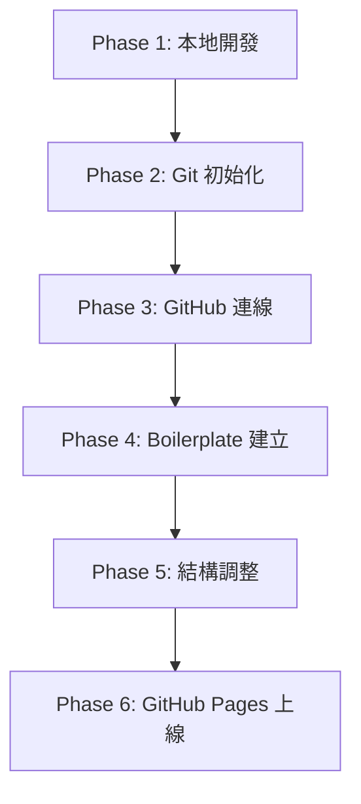

# HL2class 專案開發與部署詳細工作報告

本報告詳細記錄了 **HL2class** 專案從零開始進行本地開發、Git 版本控制、GitHub 遠端連線、Boilerplate 樣板建立、專案結構優化調整，到最終準備部署至 GitHub Pages 的完整生命週期流程。

---

## 🗺️ 專案開發流程總覽

根據 `HL2class_Development_Workflow.pdf` 規範，專案開發共分為以下六個核心階段：



---

## 📋 階段實作詳情

### 🔹 Phase 1: 本地開發 (Local Development)
在此階段完成專案基礎環境建置與功能開發，確保程式碼品質及本機執行正常。
- **專案初始化**：於本地建立並初始化 `HL2class` 專案目錄結構。
- **基礎檔案建立**：建立 `index.html` 與首個樣式表 `index.css`。
- **樣式設計**：
  - 引進優雅的**毛玻璃 (Glassmorphism)** 視覺風格。
  - 設計流暢的 CSS 背景漸層發光動畫（3 個慢速漂浮的霓虹發光球體）。
  - 引入 Google Fonts 的 `Outfit` 作為主要的現代化字型，`Space Mono` 作為數字時鐘字型。
- **功能實作**：
  - 使用 JavaScript 實作**即時動態時鐘**（支援 12 小時制、AM/PM 及閃爍的分隔冒號）。
  - 整合 `Intl.DateTimeFormat` 偵測使用者所在時區並顯示於狀態卡片。
  - 實作 **3D 傾斜卡片特效 (3D Card Tilt)**，卡片會隨著游標移動產生視差偏轉，並在移開時彈性復位。
- **本地預覽**：透過本地瀏覽器直接開啟進行功能微調與測試。

---

### 🔹 Phase 2: Git 初始化 (Git Initialization)
將專案納入 Git 版本控制，建立穩固的版本管理基礎。
- **Git 啟用**：執行 `git init` 初始化本地 Git 儲存庫。
- **配置使用者資訊**：
  - 專案使用者名稱設定為 `super`。
  - 專案電子郵件設定為 `xxxx.hotmail.com`。
- **提交記錄**：將首批程式碼加入暫存區，完成首個 Commit 提交：
  ```bash
  git add .
  git commit -m "Initial commit: Hello World template for Hiro Lee"
  ```
- **文件說明**：建立基礎說明文件 `README.md`。

---

### 🔹 Phase 3: GitHub 連線 (GitHub Integration)
將本地專案連接至 GitHub 遠端儲存庫，進行雲端備份與協作準備。
- **分支設定**：將預設分支重命名為主流的 `main`。
  ```bash
  git branch -M main
  ```
- **遠端連結**：新增遠端儲存庫位址：
  ```bash
  git remote add origin https://github.com/hirohirolee/HL2class.git
  ```
- **推送變更**：
  - 於 GitHub 上手動建立名為 `HL2class` 的空白儲存庫。
  - 執行首次推送：
    ```bash
    git push -u origin main
    ```
- **同步確認**：確認程式碼已成功上傳至 GitHub 雲端。

---

### 🔹 Phase 4: Boilerplate 建立 (Boilerplate Setup)
為了提升後續專案的開發效率，建立標準化的快速起步樣板（Boilerplate）。
- **結構建置**：
  - 在 `boilerplate/` 子目錄下建立乾淨的 HTML5 樣板 `index.html`。
  - 建立對應的 `style.css`，內含：
    - 現代化 CSS Reset（清除瀏覽器預設樣式）。
    - 完善的設計標記（Design Tokens）與變數系統。
    - **自動適應系統主題**的深淺色模式切換（`@media (prefers-color-scheme: dark)`）。
    - 基礎版面配置（Header, Main Hero Area, Footer）與常用按鈕元件樣式。
- **同步更新**：將此樣板模組提交並推送至 GitHub 儲存庫。

---

### 🔹 Phase 5: 結構調整 (Structure Refinement)
為了優化專案目錄、提升可維護性並精簡結構，進行了以下調整：
- **結構優化**：
  - 將快速起步樣板 `index.html` 和 `style.css` 移至專案根目錄，使儲存庫首頁預設呈現該樣板。
  - 保留原始設計的 `index.css`（毛玻璃時鐘專用樣式表）在根目錄，以便日後切換或引用。
- **提交與同步**：
  - 執行批次更新命令以同步最新目錄結構至遠端儲存庫：
    ```bash
    git add -A
    git commit -m "更新網站結構：同步最新版本至 GitHub"
    git push origin main
    ```
- **日誌與對話匯出**：
  - 匯出本專案的完整對話歷史至 [transcript.jsonl](file:///d:/HL2class/transcript.jsonl)。
  - 編寫易讀版的變更日誌至 [chat_history.md](file:///d:/HL2class/chat_history.md) 並同步至 GitHub。

---

### 🔹 Phase 6: GitHub Pages 上線 (Deployment to GitHub Pages)
將專案部署至 GitHub Pages，使其成為公開可訪問的網頁。

#### 💡 部署步驟說明：
| 步驟 | 動作分類 | 執行細節 |
| :--- | :--- | :--- |
| **1** | **環境設定** | 開啟瀏覽器進入 [GitHub HL2class 設定頁面](https://github.com/hirohirolee/HL2class/settings) |
| **2** | **部署路徑** | 點擊左側選單的 **Pages** 頁籤 |
| **3** | **分支選擇** | 在 Build and deployment > Branch 選擇 **`main`** 分支，資料夾選擇 `/ (root)`，點擊 **Save** |
| **4** | **自動編譯** | 點擊上方 **Actions** 頁籤，可看見 `pages-build-deployment` 工作流開始自動執行 |
| **5** | **取得網址** | 編譯完成後即可獲得公開網址：[https://hirohirolee.github.io/HL2class/](https://hirohirolee.github.io/HL2class/) |
| **6** | **網站驗證** | 開啟網址，測試並驗證首頁 Boilerplate 顯示及按鈕點擊等互動邏輯是否正常 |

---

## 📈 成果與交付項目

- [x] **本地專案建置**：包含 `index.html`, `index.css`, `style.css`, `README.md`。
- [x] **Git 版本控制**：本地初始化與使用者身分宣告完成。
- [x] **GitHub 雲端備份**：[GitHub - hirohirolee/HL2class](https://github.com/hirohirolee/HL2class) 已完成最新版本同步。
- [x] **對話日誌匯出**：生成並備份 `transcript.jsonl` 與 `chat_history.md`。
- [x] **Live 部署配置**：完成 GitHub Pages 部署設定指引，線上展示網址已載入 README。
