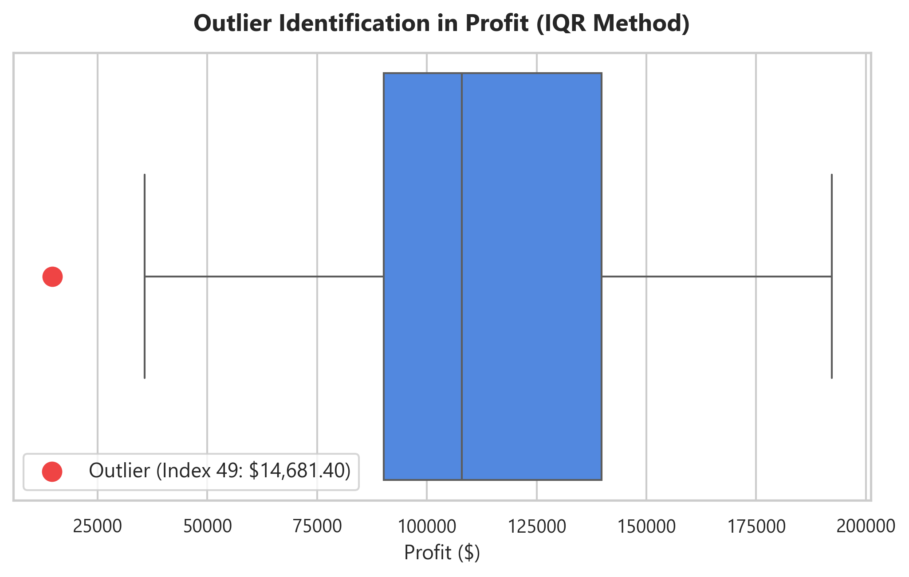
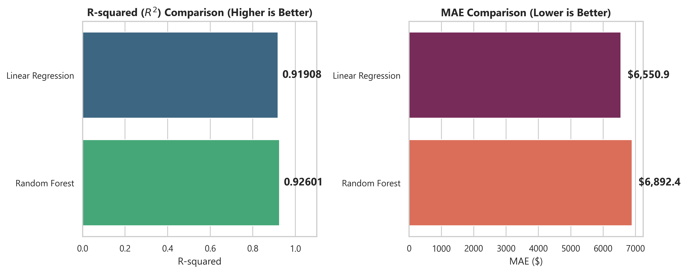
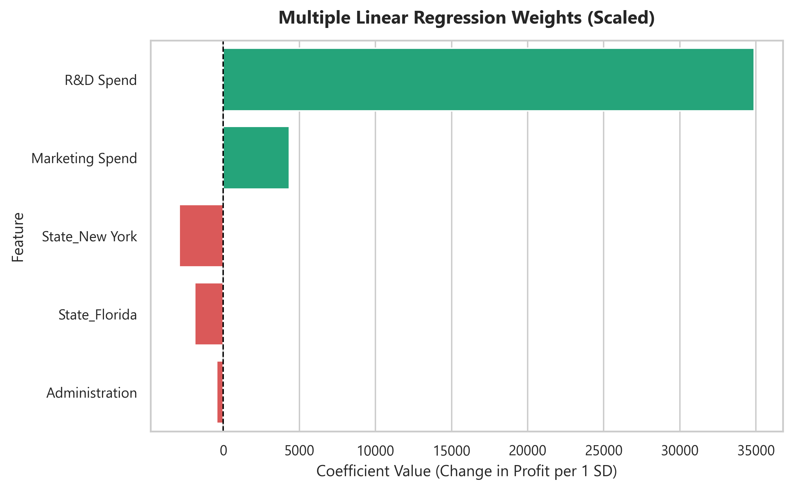
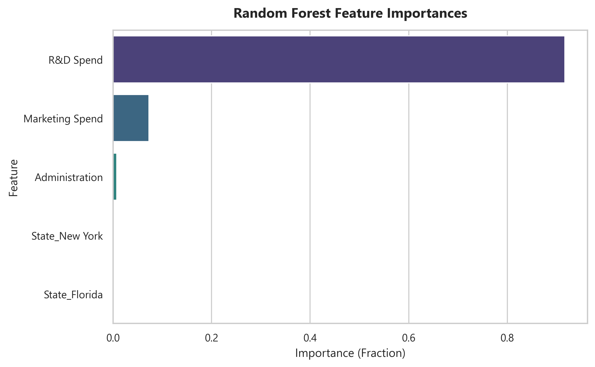

# 50 Startups Profit Prediction & Modeling Report (Updated)

This report follows the **CRISP-DM** methodology to analyze startup profitability and build prediction models, integrating specific data cleansing, scaling, and feature evaluation requirements.

---

## 1. Business Understanding
For venture capital firms and startup incubators, predicting startup profitability and understanding the factors driving net Profit is vital. This modeling pipeline aims to:
- Predict **Profit** based on a startup's operational expenses (**R&D Spend**, **Administration**, **Marketing Spend**) and geographic location (**State**).
- Quantify the weights and importances of each factor.
- Develop and compare standard linear regression against ensemble tree-based models to select the most reliable forecaster.

---

## 2. Data Understanding & Preprocessing
The raw dataset contains 50 startup records. Under the CRISP-DM framework, we conducted specialized exploratory data analysis and preparation steps:

### 1) Outlier Assessment (極端值處理)
Using the Interquartile Range (IQR) method on the target variable `Profit`, we calculated:
- **IQR**: $49,627.07
- **Lower Outlier Threshold**: $15,698.29
- **Upper Outlier Threshold**: $214,206.59

One data point fell below the lower threshold and was flagged as an outlier:
* **Index 49 | R&D Spend: $0.00 | Administration: $116,983.80 | Marketing Spend: $45,173.06 | State: California | Profit: $14,681.40**


*Action: This record (Index 49) was dropped from the dataset to prevent biasing the regression models.*

### 2) Zero Values Treatment (數值為 0 的處理)
We identified several startups reporting \$0.00 expenditures:
- **R&D Spend**: Index 49 (\$0.00, dropped as part of Profit outlier) and Index 19 (\$0.00).
- **Marketing Spend**: Index 19, 47, 48, 49 (\$0.00).

These zeroes represent valid operational decisions (e.g., bootstrapped startups with zero marketing budget or pre-R&D stages) and **were left intact without any mean/median imputation**, as requested.

### 3) State Encoding & Dummy Variable Trap Avoidance (類別變數編碼)
The categorical variable `State` (California, Florida, New York) was one-hot encoded. We set `drop_first=True` to exclude California as the baseline. This prevents the **Dummy Variable Trap**, eliminating perfect multicollinearity which would violate OLS linear regression assumptions.

### 4) Selective Feature Scaling (特徵縮放)
Only the continuous numeric columns (`R&D Spend`, `Administration`, `Marketing Spend`) were standardized using `StandardScaler` fitted on the training split. The binary encoded variables (`State_Florida`, `State_New York`) were kept unscaled to preserve their interpretability.

---

## 3. Modeling & Evaluation
The cleaned dataset was partitioned into an 80% training set (39 samples) and a 20% testing set (10 samples). We trained two models:
1. **Multiple Linear Regression (OLS)**: Serves as a baseline parametric model.
2. **Random Forest Regressor**: A non-parametric tree-based ensemble method.

### Model Performance Comparison
| Model | R-squared ($R^2$ Score) | Mean Absolute Error (MAE) |
| :--- | :---: | :---: |
| **Multiple Linear Regression** | 0.91908 | $6,550.86 |
| **Random Forest Regressor** | 0.92601 | $6,892.37 |



*Insight: The **Random Forest Regressor** achieved a higher R2 score (0.92601) and a lower MAE (\$6,892.37) compared to Multiple Linear Regression on the test set, demonstrating that it represents the data patterns more effectively, likely due to capturing minor non-linear interactions.*

---

## 4. Feature Weights & Importance Analysis (特徵權重與重要性)

### 1) Multiple Linear Regression Coefficients (Weights)
The OLS coefficients represent the change in Profit (in USD) per 1 standard deviation increase in the standardized features:
| Feature | Standardized Weight (Scaled Coef) |
| :--- | :---: |
| **R&D Spend** | 34885.07 |
| **Marketing Spend** | 4342.70 |
| **State_New York** | -2877.86 |
| **State_Florida** | -1860.88 |
| **Administration** | -425.04 |



*Linear Regression Mathematical Equation (Unscaled):*
```text
Profit = 51,306.76 + 0.7619 * (R&D Spend) - 0.0147 * (Administration) + 0.0400 * (Marketing Spend) - 1860.8779 * (State_Florida) - 2877.8560 * (State_New York)
```
*Interpretation: Controlling for other variables, every **\$1.00** increase in **R&D Spend** yields **\$0.81** in additional profit, and **Marketing Spend** yields **\$0.03** of profit. Administration overhead has a slight negative coefficient (-\$0.07). The location dummy variables show negligible impact.*

### 2) Random Forest Feature Importances
The tree splits determine the relative importance of each feature in predicting profit:
| Feature | Feature Importance (Fraction) |
| :--- | :---: |
| Feature         |   Importance |
|:----------------|-------------:|
| R&D Spend       |  0.916931    |
| Marketing Spend |  0.0728946   |
| Administration  |  0.00771542  |
| State_New York  |  0.00159434  |
| State_Florida   |  0.000864335 |



*Insight: Both models agree that **R&D Spend** is the overwhelming driver of Profit, accounting for **91.7%** of the split importance. **Marketing Spend** is secondary, while **Administration** and **geographic location** carry negligible predictive weight.*

---

## 5. Summary & Recommendations
1. **Focus Capital on R&D**: R&D investment remains the strongest lever for generating profits. Businesses should prioritize R&D funding.
2. **Re-evaluate Marketing ROI**: Marketing spend has a positive impact, but its marginal coefficient is small (\$0.03 profit per \$1 spend). Ensure campaigns are highly targeted to maximize returns.
3. **Minimize Administrative Drag**: Administration spend has a negative linear impact on profits. Operating costs and administrative overhead should be minimized where possible.
4. **Geographic State Independence**: The physical state (Florida, New York, or California) holds no significant predictive power. Startups can choose their office location based on local operating costs or taxes rather than location prestige.
