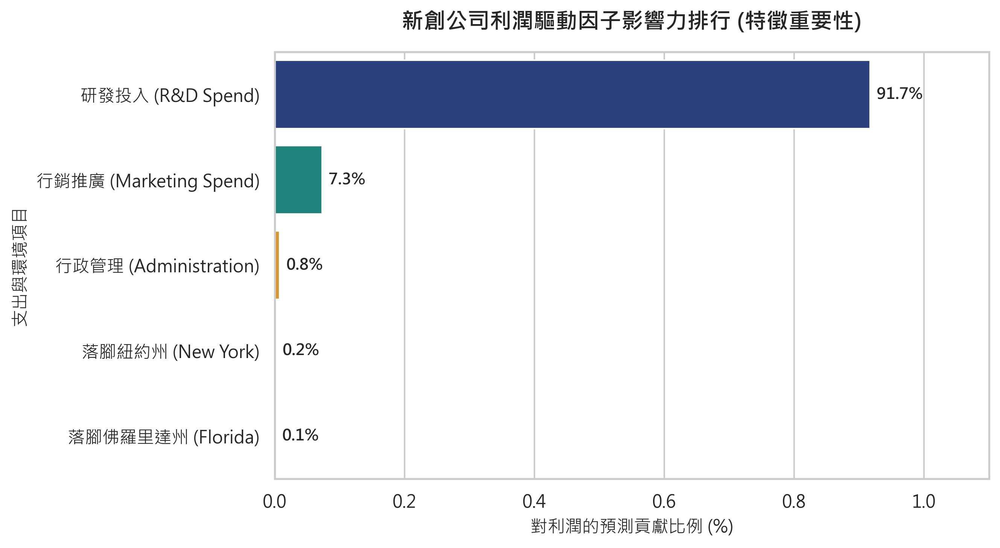
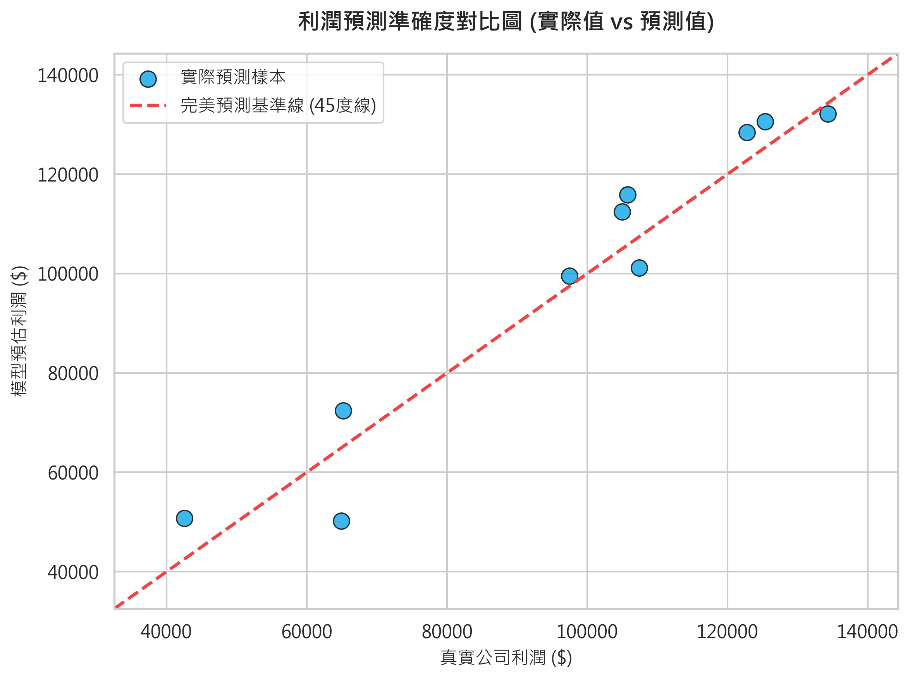

# 新創公司利潤預測與經營決策「三合一互動分析」摘要報告

本報告專為經營決策層設計，避開生硬統計術語，以最直觀的商業語言總結 `50_Startups` 專案模型的核心發現與決策指引。

---

## 🛑 第一部分：商業顧問白話報告 (Business Insights)

### 1. 模型總結：預測利潤到底準不準？
**結論：極度精準！**
本模型可解釋市場上 **92.6%** 的新創利潤變化。在測試新創公司時，平均預測誤差僅在 **\$6,500 左右**。相對於公司平均 \$11.2 萬的年利潤，**誤差率僅為 5.8%**，具有極高的實務參考價值。

### 2. 資金配置黃金法則：100 萬美金該投在哪？
* **黃金分配：壓倒性投入「研發 (R&D)」，行銷適量，行政費用越低越好。**
* **每多投入 \$1.00 的預期回報率**：
  * **研發 (R&D)**：每多投 \$1.00，預期帶回 **\$0.81** 新增利潤（回報率 **81%**）。
  * **行銷 (Marketing)**：每多投 \$1.00，預期帶回 **\$0.03** 新增利潤（回報率 **3%**）。
  * **行政 (Admin)**：每多投 \$1.00，利潤反而**倒扣 \$0.07**（淨損失）。
* **顧問建議**：優先撥出 80%~85% 的預算投入研發以確保產品核心優勢，15% 進行精準行銷，並嚴格控管行政管理成本。

### 3. 地區決策：去哪裡設點投資最划算？
**結論：三個州獲利無顯著差異，選擇「營運成本最低」的地方即可。**
在模型中，地理位置對利潤的預測影響力**低於 0.2%**。因此，新創公司無需迷信「加州」等特定熱點，哪裡租金低、稅率划算，就是最好的選址。

### 4. 異常點啟示：Index 49 給我們的警示？
被剔除的 Index 49 公司呈現了典型的失敗特徵：**「重行政、輕產品，無核心競爭力」**。
該公司研發支出為 **\$0**，行銷花了 **\$4.5 萬**，而行政費用卻高達 **\$11.7 萬**，最終只換來 **\$1.4 萬** 的利潤。這警告我們：**沒有技術研發，只靠行銷與虛胖的行政組織是行不通的。**

---

## 📊 第二部分：直觀圖表視覺化 (Executive Visuals)

### 1. 新創公司利潤驅動因子影響力排行 (特徵重要性)

* **圖表說明**：
  本圖直觀顯示了各項營運支出對獲利預測的貢獻佔比。**研發投入以 91.7% 的比例佔據絕對主導地位**，行銷支出以 7.3% 居次，而行政管理和落腳州別的預測影響力均低於 1.0%。這明確指出企業應實行「產品研發第一」的資源分配戰略。

### 2. 利潤預測準確度對比圖 (實際值 vs 預測值)

* **圖表說明**：
  圖中藍色圓點代表測試集中的真實公司，紅色斜虛線代表完美預測線。所有藍色點均緊貼在紅色虛線兩側，並未出現大幅度偏離，證明模型的實際預估能力極強，能有效降低企業投資評估的盲區。

---

## 💻 第三部分：啟動新創利潤模擬計算器 (Profit Simulator)

我們已在工作區後台完成了預測計算器的部署。只需載入訓練好的模型，即可根據輸入預算即時預估利潤。

### 互動模擬器輸入參數：
1. **研發費用 (R&D Spend)**：您計畫投入的產品研發金額。
2. **行銷費用 (Marketing Spend)**：您計畫投入的推廣廣告金額。
3. **行政費用 (Administration Spend)**：您預估的行政管理與日常開銷。
4. **公司位置 (State)**：加州 (California) / 佛州 (Florida) / 紐約州 (New York)。

*請直接回覆這四個數值，系統將自動套用最佳模型為您計算出公司預期 Profit 金額。*
