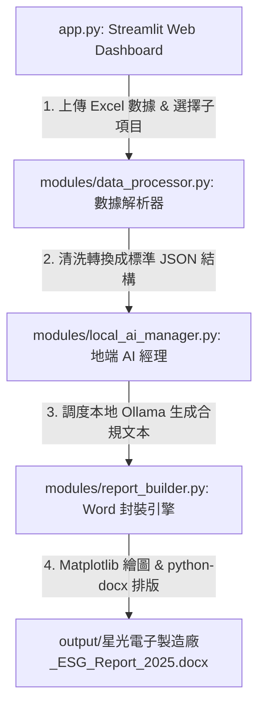

# 🌱 ESG 永續報告書自動化生成系統 (地端 AI 安全合規版)

本系統是一套專為企業打造的 **ESG 永續報告書自動化生成方案**。透過整合 Streamlit 網頁儀表板、地端安全 AI 模型 (Ollama llama3)、數據可視化 (Matplotlib) 以及高度定制化 Word 排版引擎 (python-docx)，實現一鍵解析各部門數據、自動生成合規文本、自動繪製統計圖表並封裝出高品質 Word (.docx) 報告書初稿。

---

## ✨ 系統四大核心特色

1. 🔒 **地端安全與絕對隱私**：所有 AI 文本擴寫與計算均在本地 (Localhost Ollama) 完成，確保企業核心財務與環境數據絕不上傳至任何第三方公有雲，符合嚴格的資安稽核要求。
2. 📊 **一鍵下載標準數據範本**：各部門數據上傳區提供標準 Excel 範本下載，明確規範填寫格式，避免人工整理造成的欄位偏差。
3. 📑 **細部子項目自由勾選 (Sub-items Checklist)**：全面支援所有包含的 GRI 指標細項獨立勾選，報告書會動態渲染您所勾選的章節與數據。
4. 🎨 **高質感企業識別排版**：Word 輸出模組採邊界 1 英吋規格，搭配標準企業識別色（GRI 綠與科技藍），自動生成具備**動態目錄頁碼**與**附錄 GRI 指標對照索引表**的正式文件。

---

## 🏗️ 系統架構設計

專案採用高內聚、低耦合的模組化架構開發：



* **`app.py`**：Web 控制中心。作為主調度器（小於 150 行），路由介面佈局與調用後端。
* **`ui_components.py`**：[新增] 可複用網頁 UI 元件庫。封裝企業識別 CSS、側邊欄設定、上傳區（支援上傳檔案狀態持久化於 `st.session_state`）以及揭露指標勾選清單。
* **`templates.py`**：[新增] Excel 數據模板資料。包含各指標的初始範本數據，並使用 `@st.cache_data` 快取二進位資料以加速下載。
* **`gri_config.py`**：[新增] 集中化 GRI 指標設定字典。定義 9 大指標的名稱、對應檔案、解析器方法與子章節 Prompts 描述，使指標擴充更簡潔。
* **`modules/data_processor.py`**：數據清洗模組。將上傳的 Excel 表格解析、轉換為標準的 JSON 結構，當使用者未上傳檔案時自動啟動專屬的高質量模擬數據以確保生成不中斷。
* **`modules/local_ai_manager.py`**：地端 AI 寫作調度。支援 Ollama 連線與模型下載預檢，整合 3 次重試與最低長度機制，並在連線超時/失效時自動重設連線，快速套用本地 Fallback 備用文本。
* **`modules/report_builder.py`**：排版與組裝引擎。處理 Matplotlib 數據圖表繪製（使用非互動式 `Agg` 後端避免伺服器掛起）、段落中英字型處理、邊距與表格樣式渲染，並在尾頁動態建立 GRI 揭露指標索引對照表。
* **`config.py`**：系統全域設定。包含地端 AI 模型代碼、連線網址及企業識別 HSL 顏色。

---

## 📑 支援之 GRI 揭露指標與細部子項目

系統目前全面支援以下 9 大 GRI 指標之子項目條件產出：

| GRI 指標類別 | 細部子項目代碼與名稱 | 數據表與圖表產出 |
| :--- | :--- | :--- |
| **🍀 環境面 (GRI 300)** | **GRI 305: 溫室氣體排放**<br>├─ 3.1.1 範疇一（直接排放）來源解讀<br>├─ 3.1.2 範疇二（間接排放）外購電力分析<br>└─ 3.1.3 YoY年度排放變動率與成效評估 | 範疇一與範疇二碳排放數據明細表、<br>溫室氣體範疇排放占比環狀圖 (Donut Chart) |
| | **GRI 302: 能源消耗**<br>├─ 3.2.1 組織內部能源消耗數據解讀<br>└─ 3.2.2 能源密集度與節能減量成效 | 企業能源消耗統計表（外購電力、柴油、汽油、能效密集度） |
| | **GRI 306: 廢棄物**<br>├─ 3.6.1 廢棄物產生源與源頭減量措施<br>├─ 3.6.2 廢棄物回收與循環再利用效益<br>└─ 3.6.3 廢棄物最終處置與合規評估 | 廢棄物產生與處置方式明細表 |
| **👥 社會面 (GRI 400)** | **GRI 404: 培訓與教育**<br>├─ 4.1.1 員工平均培訓時數結構分析<br>├─ 4.1.2 員工技能提升與協助執行效益<br>└─ 4.1.3 組織人才穩定度與流動率解讀 | 培訓時數結構與流動率統計表、<br>各維度員工平均培訓時數對比長條圖 |
| | **GRI 401: 員工聘用**<br>├─ 4.1.1.b 員工流動率與新進率結構解讀<br>└─ 4.1.2 關懷福利政策與育嬰留停成效 | 員工聘用與流動指標統計表 |
| | **GRI 405: 多元與平等**<br>├─ 4.5.1 治理機構與員工結構多元化比例<br>└─ 4.5.2 男女同工同酬與平等晉升機會 | 管理與基層員工多元化結構表（性別、年齡層占比） |
| **💼 治理與經濟面** | **GRI 201: 經濟績效**<br>├─ 2.1.1 直接產生與分配之經濟價值分析<br>└─ 2.1.2 氣候變遷對企業營運之財務衝擊 | 201.1 直接產生與分配的經濟價值表 |
| | **GRI 205: 反貪腐**<br>├─ 2.5.1 反貪腐政策傳達、簽署與培訓統計<br>└─ 2.5.2 誠信經營確立事件與檢舉防範機制 | 205.1 反貪腐與誠信經營運作指標表 |
| | **GRI 2: 一般揭露**<br>├─ 2.2.1 組織基本概況、據點與資本規模<br>├─ 2.2.2 商業活動與供應鏈價值關係<br>└─ 2.2.3 員工聘用特性與人力資源分佈 | 組織基本概況與特性數據表 |

---

## 🛠️ 環境配置與運行指南

### 1. 安裝必要 Python 庫
請於本專案根目錄下執行以下指令安裝依賴項目：
```bash
pip install streamlit pandas matplotlib python-docx openpyxl ollama
```

### 2. 配置地端 Ollama AI 環境
* 下載並安裝 [Ollama](https://ollama.com/)。
* 打開終端機下載本專案預設的模型：
  ```bash
  ollama run llama3
  ```
  *(下載完成後，請確保 Ollama 程式在背景正常運行，連線連接埠為 `11434`)*

### 3. 啟動 Web 儀表板
於專案根目錄執行以下指令啟動系統網頁：
```bash
streamlit run app.py
```
啟動後，瀏覽器會自動開啟 `http://localhost:8501/`，您即可開始操作數據範本下載、上傳以及報告書生成。

---

## 🧪 自動化集成管道驗證

為了確保後端所有解析、文本寫作及排版模組不受修改影響，本專案提供單元與整合測試指令。請於 PowerShell 中執行以下指令：

```powershell
$env:PYTHONIOENCODING="utf-8"
python -u test_esg_generation.py
```

**驗證輸出範例：**
```text
====== 🚀 開始進行 ESG 報告生成系統驗證 ======

⏳ [步驟 1] 正在測試環境 Excel 解析...
✅ 環境數據解析成功！輸出 JSON 樣貌如下：
總排放量: 3446.5 tCO2e, YoY: -3.5%

⏳ [步驟 2] 正在測試人資數據解析與預設回退...
✅ 人資數據解析與備用初始化成功！輸出項目數：
培訓指標數: 6, 離職指標數: 2

⏳ [步驟 3] 正在測試地端 Ollama 子章節文本生成...
📝 生成 GRI 305 子章節文本中...
⏳ 正在生成地端 AI 子章節文本: 3.1.1 範疇一（直接溫室氣體排放）來源與數據深度解讀 ...
⏳ 正在生成地端 AI 子章節文本: 3.1.2 範疇二（能源間接溫室氣體排放）外購電力分析與減碳路徑 ...
⏳ 正在生成地端 AI 子章節文本: 3.1.3 年度排放變動率（YoY）與減量成效評估 ...
✅ GRI 305 子章節生成成功！

⏳ [步驟 4] 正在測試圖表渲染與 Word 文件組裝封裝...
✅ Word 報告書組裝並存檔成功！
📁 檔案輸出路徑: D:\My-Learning-Journey\ESG REPORT\output\星光電子製造廠_ESG_Report_2025.docx

🎉 ====== 所有後端模組驗證完畢，功能一切正常！ ======
```
