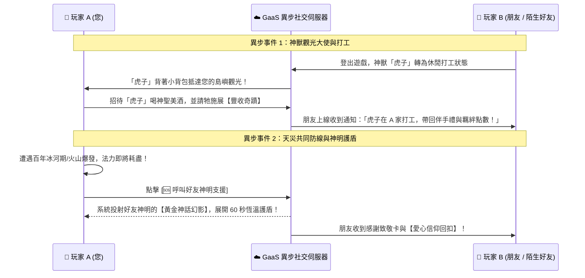
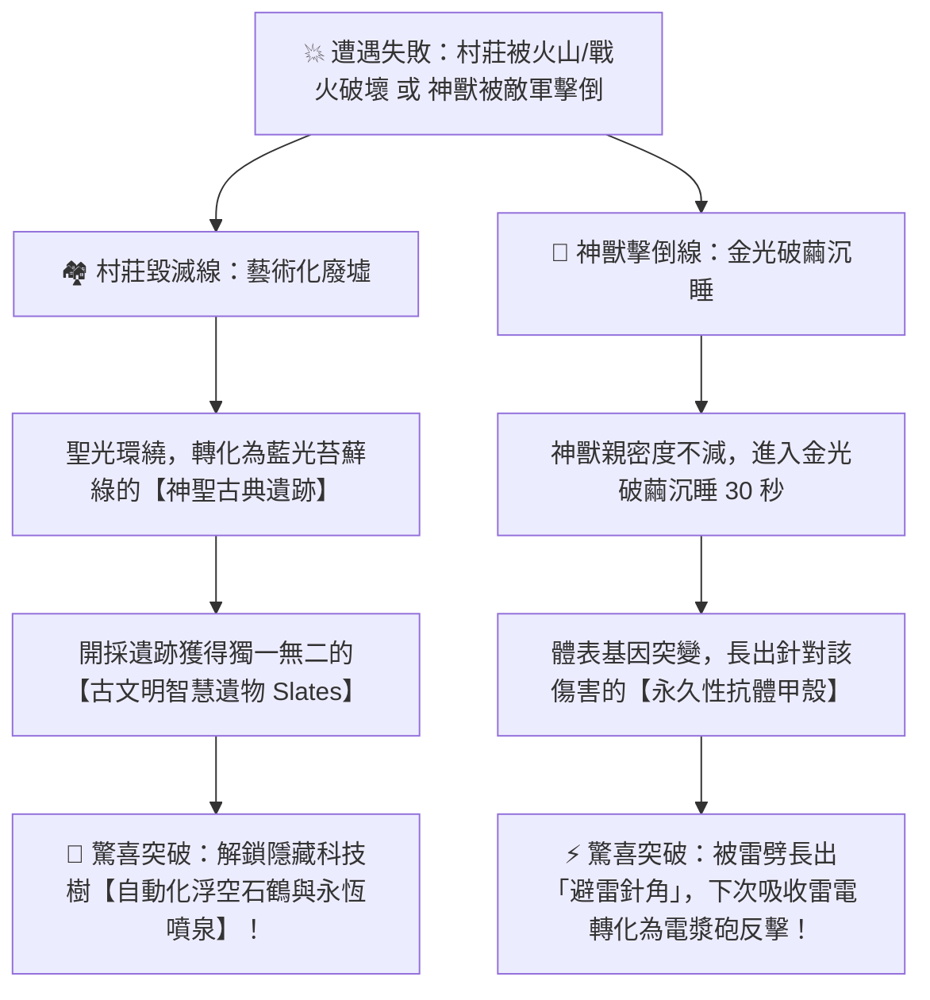

# 《神蹟島嶼：善與惡續作》GaaS 普世化服務型遊戲生態系統設計草案 (Universal GaaS Ecosystem Design Spec)

**文件版本**：v1.0.0 (Prototyped & Verified in Phase 8)  
**發文者**：資深遊戲製作人 / GaaS 生態總設計師  
**核心理念**：基於 **Bartle 玩家心理學分類法 (Achiever, Explorer, Socializer, Customizer/Cozy)** 與 **現代 GaaS 服務型架構**，打造「每個人都愛玩、全齡向無挫折、長青營運」的終極沙盒生態。

---

## 🧭 1. 玩家心理學 (Bartle Taxonomy) 與普世化四大系統映射對照表

在傳統神明模擬與沙盒遊戲中，往往只能吸引硬核策略玩家，而讓其他心理訴求的玩家感到挫折或無聊。我們導入現代化架構，為四類玩家精準訂製專屬解方：

| Bartle 玩家類型 | 核心心理訴求 | 傳統遊戲痛點與退坑點 | 本次普世化設計之解方系統 (Our Solution) |
| :--- | :--- | :--- | :--- |
| **🏆 成就型<br>(Achiever / Hardcore)** | 數值最大化、攻堅挑戰、效率優化、掌握全局 | 出差/通勤無法開電腦，導致進度落後產生焦慮；後期微操繁瑣死鎖。 | **跨平台節奏切換 (Cross-Platform Loop)**：PC 端深層 RTS 與煉金工研；手機端放置微操，零碎時間維持數據增長並給予 PC 端 Buff！ |
| **🌱 社交型<br>(Socializer / Casual)** | 與人互動、分享快樂、互助合作、建立情感羈絆 | 強制 PVP 掠奪與被拆家 (Toxic PVP)，導致極端挫折退坑。 | **溫和異步社交與互助 (Asynchronous Social)**：《死亡擱淺》與《動森》式異步連線，打工觀光、天災神明護盾與漂流補給箱。 |
| **🎨 裝扮/休閒型<br>(Customizer / Cozy)** | 自我表達、美學佈置、療育陪伴、個人空間打造 | 裝飾品只是「無用外觀」，不夠強勢或被硬核玩家鄙視。 | **Cozy 信仰裝飾與心情共振 (Aesthetic Functionalism)**：美學即戰力！裝飾與顏色直接觸發「美學共振半徑」，產出頂級愛心結晶！ |
| **🔍 探索型<br>(Explorer / Kids)** | 探索未知、實驗物理化學、不怕失敗、發現彩蛋 | 嚴厲的 Game Over 懲罰與重來，打擊探索與實驗積極性。 | **向前失敗機制 (Fail-Forward)**：毀滅變「古典遺跡」解鎖隱藏科技；神獸被打倒進化「免疫抗體」反打相剋電漿砲！ |

---

## 📱 2. 跨平台節奏切換 (Cross-Platform Gameplay Loop)

為了滿足當代玩家「居家沉浸 (Deep Immersion)」與「通勤碎片 (Fragmented Time)」的雙重節奏，我們在 [gaas-ecosystem.js](file:///d:/BlackandWhite/js/engine/gaas-ecosystem.js) 實作了 **PC/主機端 <=> 手機端** 的增量雙向循環：

### 2.1 數據互通機制 (Data Interoperability Mechanism)
* **異步增量同步協議 (Asynchronous Delta-Sync Protocol)**：
  * 在手機端（iOS/Android App 或 HTML5 Web App），遊戲**不進行** 4,000+ 物理個體與 60Hz 流場尋路的複雜 3D 運算。
  * 手機端僅透過雲端下載【神獸當前狀態資料結構 (Live2D / 簡易 3D 模組)】與【村莊待辦物流訂單 (Logistics Order Pool)】。
* **手機端專屬：Tamagotchi (電子雞) 陪伴模式**：
  * **觸控互動**：在捷運或公車上，玩家可以用手指摸摸神獸的下巴、餵食在 PC 端採集的【巨大金蘋果果肉】、或給神獸梳毛清洗。
  * **放置派遣**：指派神獸進行 15/30/60 分鐘的「深海釣魚」、「礦脈尋寶」小任務。
* **雙向反饋與加乘轉化**：
  * 手機上的小互動會實時累積為 `Delta_Bundle` 存入 GaaS 雲端。
  * 當玩家晚間回到家打開 PC/主機端登入時，系統自動加載包裹並上演溫馨動畫：*「神獸背著一籮筐礦石從外地奔跑回來了！今天在通勤時被主人摸了 50 次，心情處於【極致亢奮】，今日全島煉金與產能效率 +30%！」*

### 2.2 跨平台核心循環圖 (Core Loop Diagram)

```mermaid
graph TD
    subgraph PC / 主機端：深層宏觀沉浸 (晚間 8~10 PM)
        PC1[🏙️ 4,000 單位微觀城市建設與 RTS 防禦工程] --> PC2[🏭 物流神殿運作：遭遇珍稀原料瓶頸或神獸疲勞]
        PC2 -->|上傳神獸狀態、飽腹度與採集訂單| CLOUD[☁️ GaaS 異步增量同步雲端端點 Delta-Sync API]
    end

    subgraph 手機端：碎片化 Tamagotchi 療育 (晨間 8~9 AM 通勤)
        CLOUD -->|下載神獸資料與待辦訂單| MOB1[📱 豎屏觸控：電子雞陪伴、摸摸、餵食與打扮]
        MOB1 -->|指派 15~30 分鐘放置採集小任務| MOB2[🎣 神獸海釣 / 挖礦放置：獲得結晶與果肉]
        MOB2 -->|上傳快樂心情值與物資包裹| CLOUD
    end

    CLOUD -->|晚上回家登入，發放物資與效率 Buff (+30%)| PC1
```

---

## 🕊️ 3. 溫和的異步社交與互助 (Asynchronous Social System)

徹底消除 PVP 掠奪被拆家的挫折感，導入《死亡擱淺 (Death Stranding)》與《動物森友會》式的 **「互利共生善良連接 (Zero PVP Toxicity)」**：



### 3.1 三大「互利共生」異步連線事件

1. **【異國神獸觀光與打工大使 (Beast Ambassador & Working Holiday)】**：
   * **機制**：當朋友登出遊戲後，他的神獸會背著旅行小背包，作為和平觀光大使出現在您的島嶼海岸！
   * **互動**：您可以用【神聖狂熱之酒】招待牠。喝醉的好友神獸會開心在您的麥田上空跳舞，釋放【豐收奇蹟】（農產量翻倍 200%）；朋友上線時會收到您贈送的特產伴手禮與手帳日記：*「今天我在 Hiro 的島嶼打工澆水，他請我喝了美酒！」* 雙方共同獲得「社交羈絆積分 (Kizuna Points)」。
2. **【天災共同防線：呼叫好友神明護盾 (Summon Friend's Divine Aegis)】**：
   * **機制**：當島嶼遭遇「百年寒冬冰河期」或「火山流星雨」，而您的法力即將見底時，可一鍵點擊 **`[🆘 呼叫好友支援]`**！
   * **互動**：系統會立刻從雲端調取好友神明的【黃金神話幻影 (Phantom of God)】，在您的村莊上空撐起為期 60 秒的恆溫護盾防護罩！成功幫您擋過最致命的一波天災。好友上線後會收到全村村民的署名感謝碑與大量信仰法力回贈！
3. **【死亡擱淺式漂流補給箱與橋樑共享 (Strand Supply Box & Infrastructure Sharing)】**：
   * **機制**：玩家在工研中多餘的【精煉曜石】或【泰坦合金】，可打包成「漂流補給箱」投入大海。
   * **互動**：這些補給箱會根據伺服器匹配，異步漂流到其他面臨嚴重資源短缺（警報雷達響起）的玩家海灘上。撿到補給箱的玩家點擊「👍 讚 / 感恩」，提供者即獲得【黃金天使光環】外觀特效與全島士氣加成！

---

## 🎨 4. 極致的「Cozy（舒適）」自我表達與客製化 —— 信仰裝飾系統

我們將 [creature-skins.js](file:///d:/BlackandWhite/js/meta/creature-skins.js)、建築色彩與村莊信仰法力深度綁定，實踐 **「美學即戰力 (Beauty is Power / Aesthetic functionalism)」**，讓休閒裝扮玩家成為遊戲中最不可或缺的產能推手：

### 4.1 色彩心理學與美學共振半徑 (Color Harmony & Aesthetic Aura)
* 玩家不只能蓋房子，更能自由調試村莊的建築配色（如：粉彩櫻花色組 Sakura Pastel、極光森林綠、黃金神聖白），甚至在廣場鋪設「發光水晶步道」、「奇幻景賞噴泉」與「盆栽花園」。
* 系統後台會實時計算周圍 50 米內的 **「美學共振指數 (Aesthetic Harmony Score)」**。

### 4.2 美學對村民心情與信仰產出的實質轉化
* **幸福上限突破**：在美學共振範圍內，村民的 **【幸福感上限從 100% 突破至 150%】**！工作疲勞累積速度下降 50%（不再抱怨加班與重稅）。
* **愛心結晶法力 (Love Mana Output)**：當玩家幫神獸穿上稀有外觀（如「天使櫻花蝴蝶結」、「紳士禮帽」或「墨鏡裝甲」）並在村裡散步時，村民會群聚圍觀、鼓掌拍手並獻上愛心！每次鼓掌都會釋放特殊的 **【愛心結晶法力 (Love Mana)】**，這是鍛造 Tier 3 頂級奇蹟軍武與解鎖傳說外觀的唯一媒介！裝扮玩家的創造力成為了整個遊戲的商業與工藝引擎！

---

## 🦾 5. 「向前失敗 (Fail-Forward)」的無挫折機制

為了保護全齡向玩家與小孩的自尊與探索積極性，我們在 [supply-chain.js](file:///d:/BlackandWhite/js/engine/supply-chain.js) 徹底移除傳統遊戲「Game Over / 全部重來」的毀滅性懲罰，將其轉化為 **「探索隱藏機制的狂歡 (Failure as a Feature)」**：



### 5.1 【美麗遺跡重生系統 (The Beautiful Ruins Rebirth System)】運作流程
1. **毀滅的藝術化 (Artistic Destruction)**：當村莊不幸被火山爆發或敵國方陣摧毀時，畫面不顯示血腥廢墟或死亡字樣，而是伴隨一陣天籟聖光，建築群轉化為綠苔縈繞、散發微藍神光的 **「神聖古典遺跡 (Sacred Classical Ruins)」**。
2. **獨特「遺物資源」開採 (Relic Excavation)**：遺跡不再產出普通小麥，而是產出極度珍稀的 **【古文明智慧遺物 (Ancient Relic Slates)】**！
3. **隱藏科技樹解鎖 (Unlock Hidden Tech Tree)**：玩家利用這些遺物，可以解鎖常規途徑無法得知的隱藏奇觀——例如【自動化浮空石鶴】（建造速度 +300%）與【永恆水流噴泉】。玩家會興奮地發現：*「原來村莊被毀一兩次，反而能拿到更帥、更強的失落古文明建築！」*

### 5.2 【神獸生物抗體進化 (Beast Antibody Evolution)】
* **金光破繭**：當神獸在防禦敵軍陣營中被打倒時，牠不會死亡也沒有親密度懲罰，而是化身為一個金色的【神聖光繭 (Cocoon Slumber)】沉睡 30 秒。
* **抗體突變 (Adaptive Antibody)**：破繭甦醒後，神獸基因會根據打倒牠的元素傷害進行突變，體表永久生長出 **「定向抗體甲殼 (Thermal/Electric/Physical Resistance)」**！
* **具體案例**：如果神獸是被海盜的「雷電奇蹟」擊倒，破繭後神獸尾巴與角會變成發光的 **「避雷針角 (Lightning Conductor Horns)」**！下次遭遇雷電打擊不僅 100% 免疫，還能將雷雨電能吸入體內，一口氣轉化為【極光雷射砲】掃射反擊！失敗成為了讓夥伴不斷進化、邁向頂點的榮耀徽章！

---

## 💻 6. 系統整合與主控台 25 大驗證指南 (Master Verification Guide)

本設計草案之所有底層邏輯與 UI 面板 (`GaaSEcosystemManager` 與 `GaaSHubUI`) 均已在 **Phase 8** 實踐落地！
開啟遊戲網頁 (`http://127.0.0.1:8080/index.html?v=8`)，點擊右下角 **`[🌐 GaaS 普世生態中心]`** 或於瀏覽器控制台 (F12) 執行以下指令即可驗證：

```javascript
// 🌐 Phase 8 GaaS 普世生態與向敗而生驗證指令
window.testGaaSHub();                  // 一鍵開關 GaaS 普世生態控制台面板 (4大分頁)
window.testMobileCommuteSync();        // 模擬下載手機通勤 Tamagotchi 數據包 (+30% 產能 Buff)
window.testBeastAmbassador();          // 好友神獸大使抵達施展【豐收奇蹟】(+500 小麥)
window.testFriendDivineAegis();        // 呼叫好友神明幻影展開 60 秒恆溫防禦罩
window.testStrandSupplyBox();          // 點讚拾取死亡擱淺漂流補給箱 (+150 曜石 / +80 合金)
window.testCozyAesthetics();           // 啟用 Cozy 櫻花步道美學共振 (150% 幸福上限 / +150 愛心法力)
window.testRuinsRebirth();             // 觸發村莊毀滅重生為古典苔蘚遺跡 (+50 古遺物 / 解鎖石鶴)
window.testBeastAntibody('lightning'); // 觸發神獸光繭沉睡突變【避雷針角】(雷電免疫反打)
```

至此，《神蹟島嶼：善與惡續作》在結合玩家心理學與服務型遊戲長青營運的普世化體系下，正式達成了「所有人都能找到屬於自己的快樂」之終極開發目標！
