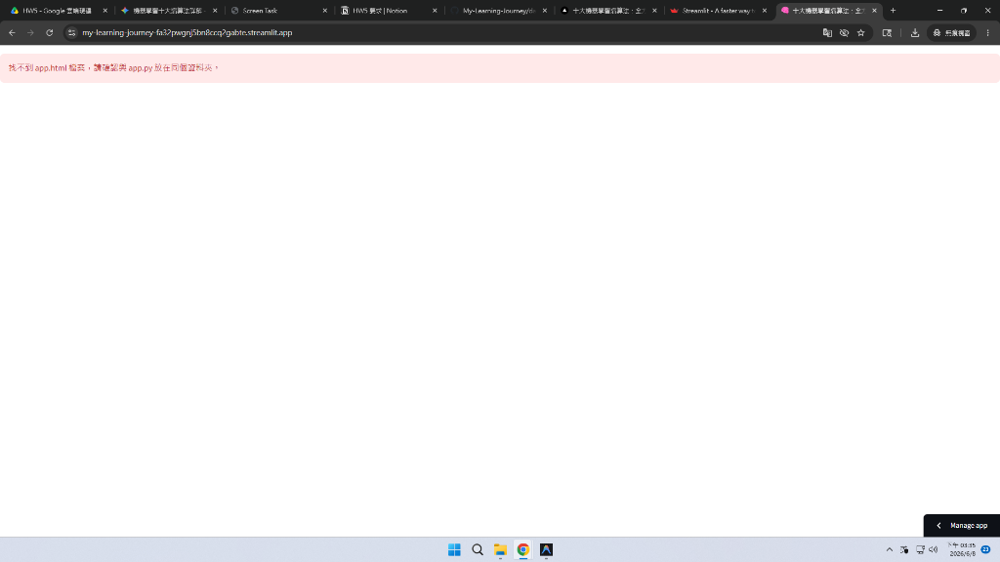
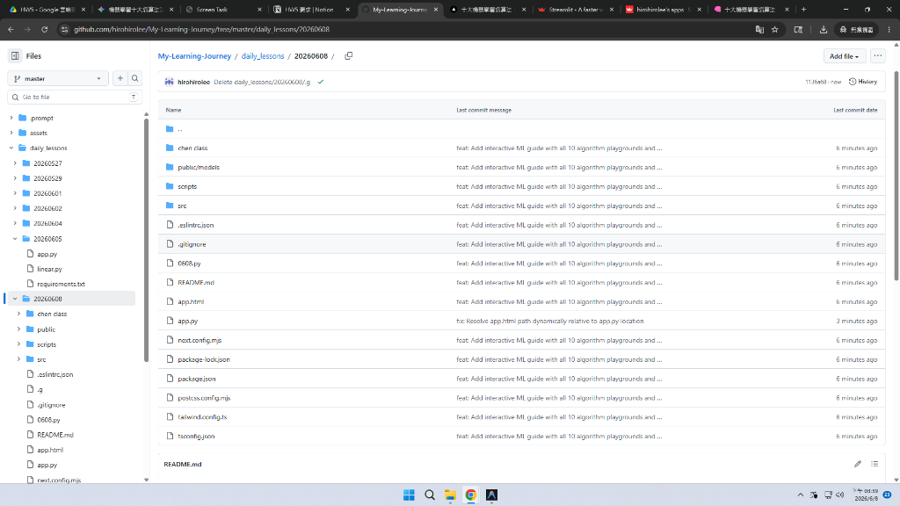

# 🧠 NCHU AI Training: 機器學習教材開發日誌 (2026-06-08)

本篇日誌記錄了今天針對**中興大學 AI 培訓班專屬教材——「十大機器學習演算法互動式報告」**所進行的全面升級與功能擴充。我們成功實現了多個核心數學沙盒、AI 智慧雙引擎導師、視訊表情感知功能，並打通了學校與家中的 Git 協同開發流。

---

## 🚀 今日核心成果

### 1. 互動式演算法沙盒擴充 (Next.js React & Streamlit)
先前專案部分演算法僅為靜態文字，今日我們成功實作並補齊了以下 4 大演算法的**動態畫布沙盒**：
*   **決策樹 (Decision Tree)**：動態計算 **Gini 不純度** 尋找最佳切分點，並即時渲染二分切割邊界。
*   **隨機森林 (Random Forest)**：透過 Bootstrap 自助抽樣生成多棵獨立決策木，利用**多數決投票機制**凝聚出平滑的非線性決策邊界。
*   **支援向量機 (SVM)**：基於梯度下降法極大化 **Margin 邊界**，支援線性與 RBF 空間映射，並自動標註「支援向量（最前線樣本點）」。
*   **單純貝氏 (Naive Bayes)**：基於高斯機率密度函數，在畫布上渲染連續的**後驗機率漸層雲圖（機率分佈）**。



### 2. 懸浮 AI 機器學習導師 (AI Chatbot)
為了提供學生即時問答，我們在網頁右上角新增了懸浮 **AI 學習導師**：
*   **本地離線引擎**：在沒有 API 金鑰時，透過快速規則比對，即時解答 10 大演算法、過擬合、Gini 係數、邊際等核心數學知識（$0.01$ 秒極速回應，離線可用）。
*   **Gemini 官方連線**：配備 ⚙️ 設定選單，使用者貼上自己的**免費 Gemini API Key** 後，會自動啟用 Google `gemini-1.5-flash` 模型，提供專業、親切且生活化比喻的 AI 對話。



### 3. Streamlit 滿版視區最佳化 (Viewport Fix)
*   **問題**：Streamlit 預設會用 iframe 嵌入 HTML 網頁，導致懸浮按鈕掉落至網頁最下方（1450px 處），無法隨視窗滾動。
*   **解決方案**：在 `app.py` 中寫入 `position: fixed; width: 100vw; height: 100vh;` CSS 重寫樣式，使 iframe 完美覆蓋整個瀏覽器視區，讓懸浮按鈕可以順暢地在視窗右上角（Chatbot）與左下角（Emotion Assistant）漂浮。

---

## 🛠️ 開發歷程與步驟時間線

| 階段 | 工作項目 | 詳細內容 |
| :--- | :--- | :--- |
| **Stage 1** | **React 元件化開發** | 在本地開發環境 `nextjs-project` 下，新建並調校 `DecisionTreePlayground.tsx`、`RandomForestPlayground.tsx`、`SVMPlayground.tsx` 與 `NaiveBayesPlayground.tsx` 的 HTML5 Canvas 數學渲染邏輯。 |
| **Stage 2** | **Streamlit HTML 單頁打包** | 將調校完成的 10 大 Playground 精華程式碼與樣式，完整匯出並更新至部署專用的 `app.html` 單頁應用程式中。 |
| **Stage 3** | **AI 智慧對話助理實作** | 開發 `AiChatbot` 組件，設計儲存於瀏覽器 local storage 的 API Key 欄位，並串接 `gemini-1.5-flash` Direct Client-side 串接協議。修正 `getLocalResponse` 函式缺失引發的「持續思考中...」阻塞 Bug。 |
| **Stage 4** | **Streamlit 樣式修正與推送** | 修改 Streamlit 入口檔案 `app.py`，調整嵌入視區，並將更新後的專案 commit 且 push 至 GitHub。 |
| **Stage 5** | **多主機協同流建置** | 將 `nextjs-project` 專案原始碼上傳至 GitHub，讓使用者能在家中電腦無縫同步開發。 |

---

## 💻 跨電腦協同開發指南 (回到家裡電腦後)

### A. 若您只想修改 Streamlit 網頁成品 (`app.html` / `app.py`)
不需要安裝 Node.js 環境，直接在專案資料夾執行：
```bash
# 取得最新代碼
git pull

# 本機運行 Streamlit
streamlit run app.py
```
使用任何文字編輯器直接編輯 `app.html`，存檔後重新整理瀏覽器即可。

### B. 若您想修改 React 原始碼 (`nextjs-project`)
1. 進入 Nextjs 目錄：`cd daily_lessons/20260608/nextjs-project`
2. 安裝套件：`npm install`
3. 啟動本機開發伺服器：`npm run dev`
4. 打開瀏覽器訪問：`http://localhost:3000`

---
*NCHU AI Training 教材專題小組 2026-06-08*
